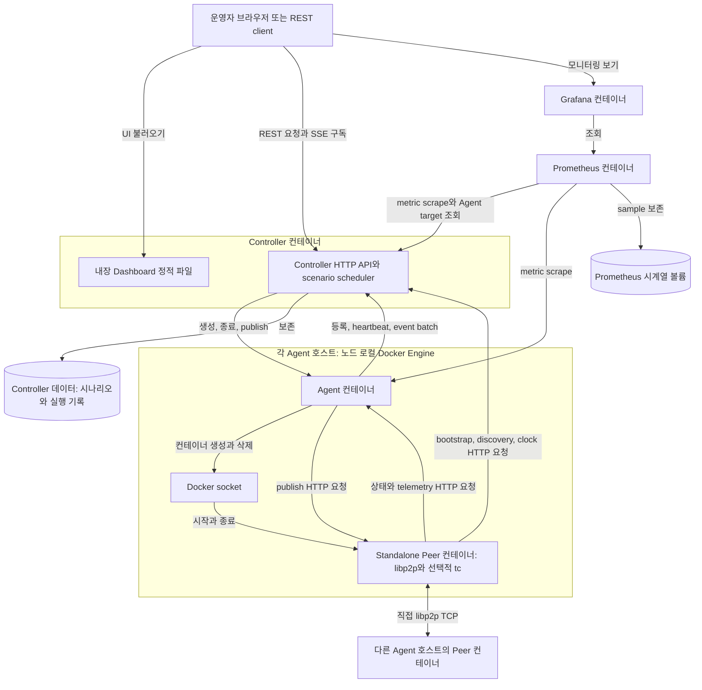

# K-P2PLab v3 구현 아키텍처

[English](architecture.md) | 한국어

이 문서는 [K-P2PLab Hub](https://github.com/k-p2p-lab/hub)의 프로젝트 공통 개념을 현재 v3 구현에 대응시킵니다. 이 저장소에 구현된 실행 컴포넌트, Docker 배치, 통신 경로와 격리 보장을 설명합니다. 프로젝트 목표, 버전에 독립적인 설계 원칙, 연구 배경과 출판물은 Hub에서 관리합니다.

화살표는 요청 또는 명령 방향이며 응답은 생략했습니다. libp2p 연결은 양방향입니다. 상자는 실행 배치와 저장소를 나타내며 별도의 Docker 네트워크를 뜻하지 않습니다. 실제 연결 관계는 아래 네트워크 표에서 정의합니다. 단일 노드 Swarm은 모든 컴포넌트를 한 호스트에서 실행하며, 여러 Agent 노드를 선택하면 Peer를 호스트 사이에 분산합니다.

## 컴포넌트

| 컴포넌트 | v3 배치 | 역할 |
|---|---|---|
| **Dashboard** | Controller에 내장되어 Controller가 제공하는 정적 웹 애플리케이션 | 실행 시작과 중지, 저장 시나리오와 결과 관리, 실시간 Agent·Peer·토폴로지·이벤트·요약 표시, 저장 분석 비교 및 JSON/CSV/SVG 내보내기를 담당합니다. |
| **Controller** | 컨테이너 하나. Swarm에서는 설정된 control 노드에 고정 | 시나리오 해석과 스케줄링, Agent 용량 예약, Peer 생명주기 및 publish 명령, bootstrap과 topic discovery registry, 토폴로지와 telemetry 집계, 실행 기록 보존, REST API와 Dashboard 제공, Controller metric 노출을 담당합니다. |
| **Agent** | 선택한 Swarm 노드마다 global-service task 하나 | Controller 등록과 heartbeat, 로컬 수용 용량 적용, 노드 로컬 Docker socket을 통한 Peer 컨테이너 생성·삭제, publish 요청 중계, Peer telemetry 전달, 호스트 로컬 Agent metric 노출을 담당합니다. |
| **Peer** | 실험 Peer마다 독립된 standalone Docker 컨테이너 하나 | Kademlia와 GossipSub을 포함한 실제 libp2p 애플리케이션을 실행하고, topic 참여와 메시지 송수신, 프로토콜·전달 이벤트와 libp2p 스트림 누적 바이트 보고, 설정된 Linux traffic-control 규칙 적용을 담당합니다. |
| **Prometheus** | 설정된 Swarm control 노드에 컨테이너 하나 | Controller metric과 조건에 맞는 Agent가 알린 metrics endpoint를 수집하며 저장된 실험 결과와 별도로 시계열을 보존합니다. |
| **Grafana** | 설정된 Swarm control 노드에 컨테이너 하나 | 사전 구성된 data source로 Prometheus를 조회하고 기본 실험 분석 dashboard를 제공합니다. |

Controller, Agent와 Peer 모드는 동일한 `kpl` 이미지의 하위 명령입니다. Swarm Agent는 현재 실행 중인 task의 정확한 로컬 image ID를 확인해 Peer를 생성하므로, mutable tag 때문에 한 배포 안에서 서로 다른 binary가 섞이지 않습니다.

## 제어 및 실험 흐름

1. 운영자가 Dashboard 또는 REST API로 시나리오를 제출합니다. Controller는 실행을 만들고 distribution을 확정하며 action을 스케줄링하고, 여유 용량이 있는 Agent에 새 Peer를 배정합니다.
2. Controller가 선택한 Agent의 비공개 HTTP API를 호출합니다. Agent는 로컬 Docker daemon에 Peer 컨테이너 하나를 만들고, 해당 Peer용으로 생성한 설정을 복사해 시작한 뒤 생명주기 상태를 Controller에 보고합니다.
3. Peer는 Controller에서 bootstrap Peer, topic discovery 후보와 Controller clock sample을 조회합니다. 이후 Kademlia와 GossipSub 트래픽은 Peer 컨테이너 주소 사이에서 직접 이동합니다. 예약된 publish는 Peer가 P2P 메시지를 보내기 전에 `Controller -> Agent -> 대상 Peer` 경로를 거칩니다.
4. 각 Peer는 상태와 batch telemetry를 자신의 Agent에 보냅니다. Agent는 각 source의 session 및 sequence identity를 유지하고 실패한 batch를 순서대로 재시도하며 주기적인 heartbeat를 Controller에 보냅니다. 서로 다른 Peer의 event는 섞일 수 있습니다. Controller는 이 보고를 바탕으로 실시간 토폴로지, 실행 metric, event stream과 보존 결과 파일을 만듭니다.
5. Prometheus는 Controller를 scrape하고 온라인으로 등록되어 유효한 metrics URL을 알린 Agent를 조회합니다. Grafana는 Prometheus를 조회하고, 내장 Dashboard는 Controller API와 live stream을 읽습니다. 저장 결과 ZIP은 Controller 보존 데이터에서 생성되며 Prometheus 시계열 데이터베이스를 포함하지 않습니다.

제어는 중앙화되어 있지만 실험 P2P 메시지는 Controller나 Agent를 경유하지 않습니다.

## Docker 네트워크와 외부 공개 endpoint

v3는 두 개의 애플리케이션 네트워크를 사용합니다. 서로 다른 Docker 네트워크이지만 모든 제어 트래픽과 데이터 트래픽이 물리적으로 완전히 분리된 것으로 해석해서는 안 됩니다.

| 네트워크 또는 endpoint 영역 | 연결 컴포넌트 | 트래픽과 공개 범위 |
|---|---|---|
| **Peer 네트워크 (`peers`)** | Controller, Agent와 모든 Peer | 외부 attachable Swarm overlay(`KPL_PEER_NETWORK`)입니다. 컨테이너 포트 20000의 직접 libp2p TCP 트래픽을 전달합니다. Peer가 이 서비스들에 비공개로 접근해야 하므로 Peer-to-Agent 상태/telemetry, Peer-to-Controller bootstrap/discovery/clock 요청과 Controller-to-Agent 명령도 전달합니다. Peer P2P 및 제어 포트는 호스트에 publish하지 않습니다. |
| **모니터링 네트워크 (`monitoring`)** | Controller, Agent, Prometheus와 Grafana. Peer는 연결하지 않음 | stack 범위의 Swarm overlay입니다. Prometheus는 여기서 Controller service DNS로 HTTP service discovery를 요청한 뒤, 응답으로 받은 control 노드와 Agent 노드의 공개 metrics 주소를 scrape합니다. 따라서 실제 수집에는 해당 호스트 포트 접근도 필요합니다. Grafana는 이 overlay를 통해 Prometheus에 접근합니다. |
| **운영자 endpoint** | 브라우저 또는 API client에서 control 호스트로 연결 | Controller/Dashboard 8080, Prometheus 9090과 Grafana 3000이 운영자용 endpoint입니다. Swarm은 설정된 control 노드에 host mode로 publish합니다. Swarm에서 Agent metric은 기본적으로 host port 9091을 사용하며 Agent 제어 API는 비공개로 유지합니다. |

Docker Swarm 자체의 manager 및 node 제어 영역은 서비스를 배포하는 인프라입니다. v3는 각 실험 Peer를 Swarm service로 생성하지 않으며, Agent가 자신의 노드에 standalone 컨테이너로 생성합니다. 따라서 Swarm은 실행 중인 Peer를 다른 호스트로 옮기거나 자동으로 재스케줄링하지 않습니다.

## Peer별 격리와 네트워크 동작

각 Peer는 독립된 컨테이너와 Linux network namespace를 갖습니다. Agent는 활성 Swarm 노드를 요구하며 명시적으로 설정한 attachable Swarm overlay에만 Peer를 생성합니다. host network, bridge network와 attach 불가능한 overlay는 거부합니다. Peer 컨테이너에는 Docker socket, host bind mount 또는 published host port가 제공되지 않습니다. 모든 Linux capability를 제거하고 `no-new-privileges`를 활성화하며, 네트워크 조건을 설치할 Peer에만 `NET_ADMIN`을 추가합니다. Peer는 privileged 컨테이너가 아닙니다.

Peer는 P2P 연결을 열기 전에 자기 namespace 안에서 `tc` 규칙을 적용합니다. 지원하는 송신 조건은 delay, jitter, loss, duplication, corruption, reordering, netem rate 제한과 선택적인 TBF shaping입니다. 기본 `scope: p2p`에서는 TCP 20000만 대상으로 삼으므로 Peer HTTP 제어 및 telemetry 경로는 impairment를 우회합니다. `scope: all`에서는 loopback을 제외한 interface 전체에 적용되어 실험의 일부로 제어와 telemetry도 지연하거나 손실시킬 수 있습니다.

이 경계 덕분에 한 Peer의 traffic-control 규칙이 다른 Peer나 호스트 interface를 변경하지 않습니다. 다만 이는 process 및 network 격리이며 전용 hardware 또는 multi-tenant 보안 경계는 아닙니다. 같은 서버의 Peer는 host kernel, CPU, memory, storage, Docker daemon과 underlay 경로를 공유합니다. 기본 구성은 Peer마다 전용 CPU나 memory 제한을 설정하지 않습니다. Docker socket 접근 권한은 해당 Docker 노드에 대한 넓은 제어 권한을 주므로 Agent는 신뢰하는 호스트 관리 컴포넌트입니다.

## Swarm 배치

단일 노드 Swarm도 다중 호스트 배포와 같은 stack과 overlay를 사용합니다. 이 구성에서는 `deploy --all`로 manager를 Agent 노드로 선택하고 `KPL_MIN_AGENTS=1`을 설정합니다.

`stack.swarm.yaml`은 Controller, Prometheus와 Grafana replica를 각각 하나씩 `KPL_CONTROL_NODE_ID`에 배치합니다. Agent는 `scripts/swarm.sh`에서 선택한 노드로 제한한 global service입니다. 각 Agent는 자기 노드의 Docker daemon만 제어하고, Controller는 등록된 Agent의 가용 수용 용량에 따라 새 Peer를 분산합니다. Agent를 추가해도 기존 Peer를 재배치하지 않습니다. Agent 노드를 제거하면 그 Agent의 Peer도 중지되므로 [Swarm 배포 가이드](swarm.kr.md)의 cleanup 절차를 따라야 합니다.

실험 overlay는 호스트 사이의 Peer 주소 연결성을 제공하지만 실제 지연과 손실에는 서버의 물리 네트워크와 Swarm VXLAN 경로도 포함됩니다. 호스트 시각 동기화와 underlay 용량은 별도의 배포 책임입니다.

## 관측 및 보존 경계

Dashboard는 Controller의 최신 상태와 이벤트를 표시합니다. Controller는 각 실행의 `scenario.yaml`, `experiment.json`과 수락한 전체 `events.jsonl`을 자신의 data volume에 저장합니다. 다운로드 시점에는 snapshot 경계를 고정하고 그 보존 prefix에서 ZIP용 `metrics.json`과 `export.json`을 계산합니다. Prometheus는 별도 volume에 scrape 기반 시계열을 저장하고 Grafana도 설정과 dashboard 상태를 별도로 저장합니다. Prometheus는 Peer별 exporter를 scrape하지 않으며 현재 Agent collector는 Peer별 CPU 또는 memory 사용량을 제공하지 않습니다. 결과 ZIP은 이식 가능한 실험 기록이며 Prometheus 또는 Grafana의 backup은 아닙니다.

Metric과 토폴로지는 수신된 보고를 바탕으로 한 관측 결과입니다. 오래되거나 연결할 수 없는 Agent, telemetry queue 손실, `scope: all` impairment, scrape 시점 또는 강제 종료 때문에 P2P 트래픽이 일부 발생했더라도 control plane의 관측량이 줄어들 수 있습니다. Metric 정의는 [실험 지표](experiment-metrics.kr.md), 수집 한계는 [모니터링과 결과](monitoring.kr.md), 그래프 의미는 [토폴로지](topology.kr.md)를 참고하십시오.

Controller는 실행 중 그룹별 토폴로지·점수 요약을 `observations.jsonl`로 주기적으로 저장합니다. 전체 관계 그래프나 평가자별 개별 점수는 보존하지 않습니다. 대역폭 표본은 이벤트로 저장하며 수신 기간의 대상 선정과 독립적으로 재계산합니다. [Bandwidth 측정](bandwidth.kr.md)을 참고하십시오. 내장 Dashboard의 [저장 결과 시각화](visualization.kr.md)는 저장된 이벤트·관측치를 분석 API로 조회해 실행별 분포와 시계열을 표시하고 여러 실행을 비교합니다. Prometheus 보존 시계열과 독립적으로 동작합니다.

## 지원 배포 경계

운영 대상은 Linux의 rootful Docker Engine입니다. Peer별 네트워크 조건은 Linux network namespace, `tc`, `NET_ADMIN`과 필요한 qdisc module에 의존합니다. 호스트 준비, 배치와 overlay 요구사항, Agent metric 접근, 저장소 및 cleanup은 [Swarm 배포 가이드](swarm.kr.md)를 참고하십시오.

## 구현 대응표

| 동작 | 구현 근거 |
|---|---|
| 컴포넌트 진입점과 Swarm 배치 | [`cmd/kpl/main.go`](../cmd/kpl/main.go), [`stack.swarm.yaml`](../stack.swarm.yaml) |
| API, scenario scheduling, admission, run cleanup | [`internal/controller/api.go`](../internal/controller/api.go), [`internal/controller/runner.go`](../internal/controller/runner.go), [`internal/controller/repeat.go`](../internal/controller/repeat.go) |
| Agent lifecycle과 Docker 격리 | [`internal/agent/agent.go`](../internal/agent/agent.go), [`internal/agent/docker.go`](../internal/agent/docker.go) |
| Peer 프로토콜, transport discovery, traffic control | [`internal/peer/peer.go`](../internal/peer/peer.go), [`internal/peer/discovery.go`](../internal/peer/discovery.go), [`internal/netem/netem.go`](../internal/netem/netem.go) |
| Dashboard와 보존 기록 | [`internal/webui/static`](../internal/webui/static), [`internal/controller/scenarios.go`](../internal/controller/scenarios.go), [`internal/controller/results.go`](../internal/controller/results.go) |
