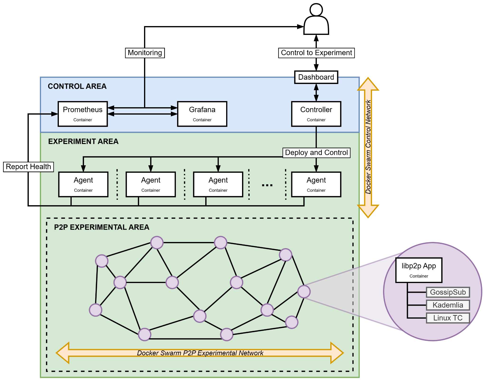

# K-P2PLab v3 Implementation Architecture

English | [Korean](architecture.kr.md)

This document maps the project-wide concepts in the [K-P2PLab Hub](https://github.com/k-p2p-lab/hub) to the current v3 implementation. It describes the executable components, Docker placement, communication paths, and isolation guarantees implemented in this repository. Project goals, version-independent design principles, research context, and publications belong in the Hub.

*This diagram describes the v3 reference implementation at the component level. Its boxes denote logical roles: the Dashboard is embedded in the Controller rather than deployed as a separate container, and the experimental Peer network also carries the Peer-facing control paths described below.*

## Components

| Component | v3 deployment | Responsibility |
|---|---|---|
| **Dashboard** | Static web application embedded in and served by the Controller | Starts and stops runs, manages saved scenarios and results, and displays live Agent, Peer, topology, event, and summary data. |
| **Controller** | One container; pinned to the configured control node in Swarm | Parses and schedules scenarios, reserves Agent capacity, issues Peer lifecycle and publish operations, maintains the bootstrap and topic-discovery registries, aggregates topology and telemetry, persists run records, serves the REST API and Dashboard, and exports Controller metrics. |
| **Agent** | One service container per configured Compose Agent or one global-service task per selected Swarm node | Registers with the Controller, reports heartbeats, enforces local admission capacity, creates and removes Peer containers through the node-local Docker socket, proxies publish requests, forwards Peer telemetry, and exports host-local Agent metrics. |
| **Peer** | One standalone Docker container per experimental Peer in the supported deployment runtime | Runs the actual libp2p application, including Kademlia and GossipSub; joins topics, publishes and receives messages, reports protocol and delivery events, and applies its own Linux traffic-control rules when configured. |
| **Prometheus** | One container on the Compose host or configured Swarm control node | Scrapes Controller metrics and the metrics endpoints advertised by eligible Agents, then retains time series independently of saved experiment result archives. |
| **Grafana** | One container on the Compose host or configured Swarm control node | Queries Prometheus through the provisioned data source and presents the bundled experiment-analysis dashboard. |

The Controller, Agent, and Peer modes are subcommands of the same `kpl` image. Swarm Agents resolve the exact local image ID of their running task and use it to create Peers, preventing a mutable tag from mixing binaries within one deployment.

The Agent CLI also has a `process` runtime for development. It starts a Peer as a child process in the Agent's execution environment, without a separate container or network namespace, and rejects network impairment settings. The supplied Compose and Swarm deployments use the isolated Docker runtime.

## Control and experiment flow

1. An operator submits a scenario through the Dashboard or REST API. The Controller creates the run, resolves distributions, schedules actions, and assigns new Peers to Agents with available capacity.
2. The Controller calls the selected Agent's private HTTP API. The Agent creates one Peer container on its local Docker daemon, copies in that Peer's generated configuration, starts it, and reports lifecycle state to the Controller.
3. The Peer asks the Controller for bootstrap peers, topic-discovery candidates, and Controller clock samples. Its Kademlia and GossipSub traffic then travels directly between Peer container addresses. A scheduled publish follows `Controller -> Agent -> target Peer` before the Peer sends the P2P message.
4. Each Peer sends status and batched telemetry to its Agent. The Agent retains each source's session and sequence identity, retries failed batches in order, and sends periodic heartbeats to the Controller; events from different Peers can interleave. The Controller builds the live topology, run metrics, event stream, and persisted result files from these reports.
5. Prometheus scrapes the Controller and each online registered Agent that advertises a valid metrics URL. Grafana queries Prometheus, while the embedded Dashboard reads the Controller API and live stream. Saved ZIP results come from Controller persistence and do not contain the Prometheus time-series database.

Control is centralized, but experimental P2P messages do not pass through the Controller or Agent.

## Docker networks and exposed endpoints

v3 uses two application networks. They are separate Docker networks, but they should not be interpreted as a complete physical separation of all control and data traffic.

| Network or endpoint plane | Attached components | Traffic and exposure |
|---|---|---|
| **Peer network (`peers`)** | Controller, Agents, and every Peer | A user-defined bridge in Compose (`kpl-v3-peers`) or an external attachable overlay in Swarm (`KPL_PEER_NETWORK`). It carries direct libp2p TCP traffic on container port 20000. It also carries Peer-to-Agent status/telemetry, Peer-to-Controller bootstrap/discovery/clock requests, and Controller-to-Agent operations because Peers need private reachability to those services. Peer P2P and control ports are not published on the host. |
| **Monitoring network (`monitoring`)** | Controller, Agents, Prometheus, and Grafana; no Peers | A private bridge in Compose and a stack-scoped overlay in Swarm. Prometheus reaches the Controller here. Compose scrapes Agent `/metrics` endpoints by service name. In Swarm, each Agent advertises its node address and host-mode metrics port, and the Controller exposes those targets through HTTP service discovery so Prometheus does not depend on a Peer-overlay address. Grafana reaches Prometheus through this network. |
| **Operator endpoints** | Browser or API client to the control host | Controller/Dashboard 8080, Prometheus 9090, and Grafana 3000 are the intended operator endpoints. Compose binds them to loopback by default. Swarm publishes them in host mode on the configured control node. Agent metrics use host port 9091 by default in Swarm; the Agent control API remains private. |

Docker Swarm's own manager and node control plane is infrastructure used to deploy the services. v3 does not create each experimental Peer as a Swarm service: the Agent creates a standalone container on its own node. Consequently, Swarm does not migrate or automatically reschedule an active Peer to another host.

## Per-Peer isolation and network dynamics

Every Docker-runtime Peer has its own container and Linux network namespace. Peer creation uses a user-defined bridge or attachable overlay and rejects host networking, the default bridge, and non-attachable overlays. Peer containers receive no Docker socket, host bind mounts, or published host ports. They drop all Linux capabilities, enable `no-new-privileges`, and receive only `NET_ADMIN` when that Peer has network conditions to install. They are not privileged containers.

The Peer applies `tc` rules inside its own namespace before opening P2P connections. Supported outbound conditions include delay, jitter, loss, duplication, corruption, reordering, netem rate limiting, and optional TBF shaping. With the default `scope: p2p`, filters target TCP port 20000 so the Peer HTTP control and telemetry path bypasses impairment. With `scope: all`, impairment applies to the full non-loopback interface and can therefore delay or drop control and telemetry as part of the experiment.

This boundary prevents one Peer's traffic-control rules from changing another Peer or the host interface. It is process and network isolation, not dedicated hardware or a multi-tenant security boundary: Peers on the same server still share the host kernel, CPU, memory, storage, Docker daemon, and underlay path. The supplied configuration does not assign dedicated CPU or memory limits per Peer. The Agent is a trusted host-management component because access to the Docker socket grants broad control over that Docker node.

## Compose and Swarm placement

The supplied `compose.yaml` is a single-host layout with one Controller, two example Agents, Prometheus, and Grafana. Those Agent containers create sibling Peer containers on the same Docker Engine and attach them to the shared bridge.

`stack.swarm.yaml` places one Controller, Prometheus, and Grafana replica on `KPL_CONTROL_NODE_ID`. The Agent is a global service constrained to the nodes selected by `scripts/swarm.sh`. Each Agent controls only its node-local Docker daemon, and the Controller distributes new Peers across registered Agents according to available admission capacity. Existing Peers are not rebalanced when an Agent is added. Removing an Agent node stops that Agent's Peers, so node removal must follow the cleanup procedure in the [Swarm deployment guide](swarm.md).

The experimental overlay provides cross-host Peer addressing, while actual delay and loss also include the servers' physical network and the Swarm VXLAN path. Host clock synchronization and underlay capacity remain deployment responsibilities.

## Observation and persistence boundaries

The Dashboard renders recent state and events from the Controller. The Controller stores each run's `scenario.yaml`, `experiment.json`, and complete accepted `events.jsonl` under its data volume. At download time it fixes a snapshot boundary and derives `metrics.json` and `export.json` for the ZIP from that persisted prefix. Prometheus keeps scrape-based time series in a separate volume, and Grafana keeps its own settings and dashboard state. Prometheus scrapes no per-Peer exporter and its current Agent collector does not provide per-Peer CPU or memory usage. A result ZIP is the portable experiment record; it is not a backup of Prometheus or Grafana.

Metrics and topology are observations of received reports. A stale or unreachable Agent, telemetry queue loss, `scope: all` impairment, scrape timing, or forced shutdown can reduce what the control plane observes even while some P2P traffic occurred. Use [experiment metrics](experiment-metrics.md) for metric definitions, [monitoring and results](monitoring.md) for collection limits, and [topology](topology.md) for graph semantics.

## Supported deployment boundary

The production target is rootful Docker Engine on Linux. Per-Peer network conditions depend on Linux network namespaces, `tc`, `NET_ADMIN`, and the required qdisc modules. Single-host setup is covered by the [Linux deployment guide](linux-deployment.md); multi-server placement, overlay requirements, Agent metrics reachability, and cleanup are covered by the [Swarm deployment guide](swarm.md).
