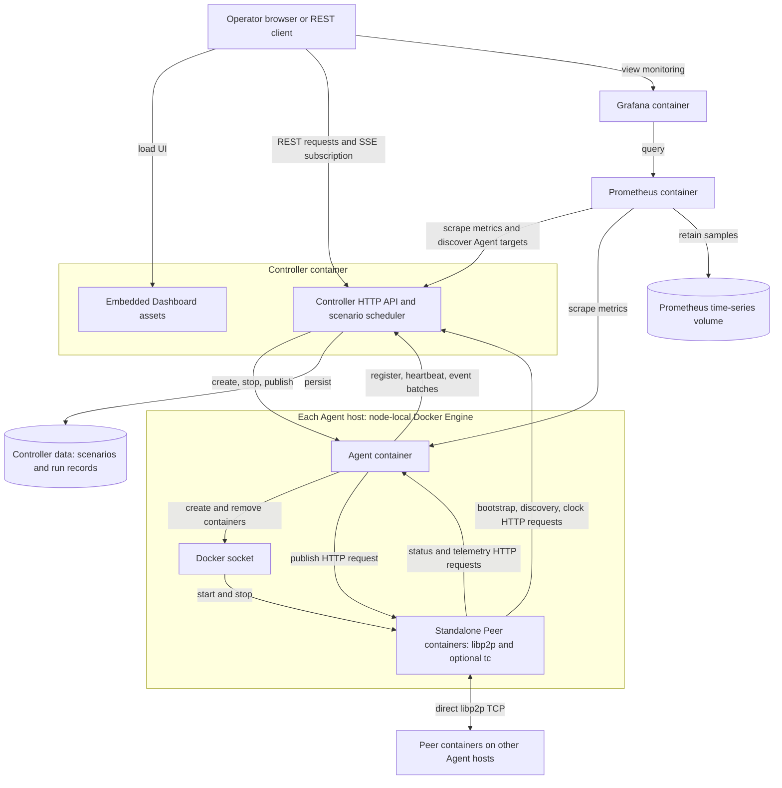

# K-P2PLab v3 Implementation Architecture

English | [Korean](architecture.kr.md)

This document maps the project-wide concepts in the [K-P2PLab Hub](https://github.com/k-p2p-lab/hub) to the current v3 implementation. It describes the executable components, Docker placement, communication paths, and isolation guarantees implemented in this repository. Project goals, version-independent design principles, research context, and publications belong in the Hub.

Arrows show request or operation direction, with responses omitted; the libp2p link is bidirectional. Boxes show executable placement and storage, not separate Docker networks. The network table below defines actual attachments. A single-node Swarm runs all components on one host; selecting multiple Agent nodes distributes Peers across hosts.

## Components

| Component | v3 deployment | Responsibility |
|---|---|---|
| **Dashboard** | Static web application embedded in and served by the Controller | Starts and stops runs, manages saved scenarios and results, displays live Agent/Peer/topology/event/summary data, and compares saved analyses with JSON/CSV/SVG export. |
| **Controller** | One container; pinned to the configured control node in Swarm | Parses and schedules scenarios, reserves Agent capacity, issues Peer lifecycle and publish operations, maintains the bootstrap and topic-discovery registries, aggregates topology and telemetry, persists run records, serves the REST API and Dashboard, and exports Controller metrics. |
| **Agent** | One global-service task per selected Swarm node | Registers with the Controller, reports heartbeats, enforces local admission capacity, creates and removes Peer containers through the node-local Docker socket, proxies publish requests, forwards Peer telemetry, and exports host-local Agent metrics. |
| **Peer** | One standalone Docker container per experimental Peer | Runs the actual libp2p application, including Kademlia and GossipSub; joins topics, publishes and receives messages, reports protocol/delivery events and cumulative libp2p stream bytes, and applies its own Linux traffic-control rules when configured. |
| **Prometheus** | One container on the configured Swarm control node | Scrapes Controller metrics and the metrics endpoints advertised by eligible Agents, then retains time series independently of saved experiment result archives. |
| **Grafana** | One container on the configured Swarm control node | Queries Prometheus through the provisioned data source and presents the bundled experiment-analysis dashboard. |

The Controller, Agent, and Peer modes are subcommands of the same `kpl` image. Swarm Agents resolve the exact local image ID of their running task and use it to create Peers, preventing a mutable tag from mixing binaries within one deployment.

## Control and experiment flow

1. An operator submits a scenario through the Dashboard or REST API. The Controller creates the run, resolves distributions, schedules actions, and assigns new Peers to Agents with available capacity.
2. The Controller calls the selected Agent's private HTTP API. The Agent creates one Peer container on its local Docker daemon, copies in that Peer's generated configuration, starts it, and reports lifecycle state to the Controller.
3. The Peer asks the Controller for bootstrap peers, topic-discovery candidates, and Controller clock samples. Its Kademlia and GossipSub traffic then travels directly between Peer container addresses. A scheduled publish follows `Controller -> Agent -> target Peer` before the Peer sends the P2P message.
4. Each Peer sends status and batched telemetry to its Agent. The Agent retains each source's session and sequence identity, retries failed batches in order, and sends periodic heartbeats to the Controller; events from different Peers can interleave. The Controller builds the live topology, run metrics, event stream, and persisted result files from these reports.
5. Prometheus scrapes the Controller and discovers online registered Agents with valid advertised metrics URLs. Grafana queries Prometheus, while the embedded Dashboard reads the Controller API and live stream. Saved ZIP results come from Controller persistence and do not contain the Prometheus time-series database.

Control is centralized, but experimental P2P messages do not pass through the Controller or Agent.

## Docker networks and exposed endpoints

v3 uses two application networks. They are separate Docker networks, but they should not be interpreted as a complete physical separation of all control and data traffic.

| Network or endpoint plane | Attached components | Traffic and exposure |
|---|---|---|
| **Peer network (`peers`)** | Controller, Agents, and every Peer | An external attachable Swarm overlay (`KPL_PEER_NETWORK`). It carries direct libp2p TCP traffic on container port 20000. It also carries Peer-to-Agent status/telemetry, Peer-to-Controller bootstrap/discovery/clock requests, and Controller-to-Agent operations because Peers need private reachability to those services. Peer P2P and control ports are not published on the host. |
| **Monitoring network (`monitoring`)** | Controller, Agents, Prometheus, and Grafana; no Peers | A stack-scoped Swarm overlay. Prometheus uses the Controller service DNS here for HTTP service discovery, then scrapes the returned published control-node and Agent-node metrics addresses. Scrapes therefore also require access to those host ports. Grafana reaches Prometheus through this overlay. |
| **Operator endpoints** | Browser or API client to the control host | Controller/Dashboard 8080, Prometheus 9090, and Grafana 3000 are the intended operator endpoints. Swarm publishes them in host mode on the configured control node. Agent metrics use host port 9091 by default in Swarm; the Agent control API remains private. |

Docker Swarm's own manager and node control plane is infrastructure used to deploy the services. v3 does not create each experimental Peer as a Swarm service: the Agent creates a standalone container on its own node. Consequently, Swarm does not migrate or automatically reschedule an active Peer to another host.

## Per-Peer isolation and network dynamics

Every Peer has its own container and Linux network namespace. Agents require an active Swarm node and create Peers only on an explicitly configured, attachable Swarm overlay. Host networking, bridge networks, and non-attachable overlays are rejected. Peer containers receive no Docker socket, host bind mounts, or published host ports. They drop all Linux capabilities, enable `no-new-privileges`, and receive only `NET_ADMIN` when that Peer has network conditions to install. They are not privileged containers.

The Peer applies `tc` rules inside its own namespace before opening P2P connections. Supported outbound conditions include delay, jitter, loss, duplication, corruption, reordering, netem rate limiting, and optional TBF shaping. With the default `scope: p2p`, filters target TCP port 20000 so the Peer HTTP control and telemetry path bypasses impairment. With `scope: all`, impairment applies to the full non-loopback interface and can therefore delay or drop control and telemetry as part of the experiment.

This boundary prevents one Peer's traffic-control rules from changing another Peer or the host interface. It is process and network isolation, not dedicated hardware or a multi-tenant security boundary: Peers on the same server still share the host kernel, CPU, memory, storage, Docker daemon, and underlay path. The supplied configuration does not assign dedicated CPU or memory limits per Peer. The Agent is a trusted host-management component because access to the Docker socket grants broad control over that Docker node.

## Swarm placement

A single-node Swarm uses the same stack and overlay as a deployment across multiple hosts. Select the manager as an Agent node with `deploy --all` and set `KPL_MIN_AGENTS=1` for that setup.

`stack.swarm.yaml` places one Controller, Prometheus, and Grafana replica on `KPL_CONTROL_NODE_ID`. The Agent is a global service constrained to the nodes selected by `scripts/swarm.sh`. Each Agent controls only its node-local Docker daemon, and the Controller distributes new Peers across registered Agents according to available admission capacity. Existing Peers are not rebalanced when an Agent is added. Removing an Agent node stops that Agent's Peers, so node removal must follow the cleanup procedure in the [Swarm deployment guide](swarm.md).

The experimental overlay provides cross-host Peer addressing, while actual delay and loss also include the servers' physical network and the Swarm VXLAN path. Host clock synchronization and underlay capacity remain deployment responsibilities.

## Observation and persistence boundaries

The Dashboard renders recent state and events from the Controller. The Controller stores each run's `scenario.yaml`, `experiment.json`, and complete accepted `events.jsonl` under its data volume. At download time it fixes a snapshot boundary and derives `metrics.json` and `export.json` for the ZIP from that persisted prefix. Prometheus keeps scrape-based time series in a separate volume, and Grafana keeps its own settings and dashboard state. Prometheus scrapes no per-Peer exporter and its current Agent collector does not provide per-Peer CPU or memory usage. A result ZIP is the portable experiment record; it is not a backup of Prometheus or Grafana.

Metrics and topology are observations of received reports. A stale or unreachable Agent, telemetry queue loss, `scope: all` impairment, scrape timing, or forced shutdown can reduce what the control plane observes even while some P2P traffic occurred. Use [experiment metrics](experiment-metrics.md) for metric definitions, [monitoring and results](monitoring.md) for collection limits, and [topology](topology.md) for graph semantics.

The Controller periodically saves group topology and score summaries in `observations.jsonl` during each run. These summaries do not retain the full relationship graph or every observer-to-peer score. Bandwidth samples are stored as events and reconstructed independently of delivery-window eligibility; see [bandwidth measurement](bandwidth.md). The embedded Dashboard uses the [saved-result analysis API](visualization.md) to visualize distributions and timelines and compare runs from saved events and observations, independently of Prometheus retention.

## Supported deployment boundary

The production target is rootful Docker Engine on Linux. Per-Peer network conditions depend on Linux network namespaces, `tc`, `NET_ADMIN`, and the required qdisc modules. Host preparation, placement, overlay requirements, Agent metrics reachability, storage, and cleanup are covered by the [Swarm deployment guide](swarm.md).

## Implementation map

| Behavior | Source of truth |
|---|---|
| Component entry points and Swarm placement | [`cmd/kpl/main.go`](../cmd/kpl/main.go), [`stack.swarm.yaml`](../stack.swarm.yaml) |
| API, scenario scheduling, admission, run cleanup | [`internal/controller/api.go`](../internal/controller/api.go), [`internal/controller/runner.go`](../internal/controller/runner.go), [`internal/controller/repeat.go`](../internal/controller/repeat.go) |
| Agent lifecycle and Docker isolation | [`internal/agent/agent.go`](../internal/agent/agent.go), [`internal/agent/docker.go`](../internal/agent/docker.go) |
| Peer protocols, transport discovery, traffic control | [`internal/peer/peer.go`](../internal/peer/peer.go), [`internal/peer/discovery.go`](../internal/peer/discovery.go), [`internal/netem/netem.go`](../internal/netem/netem.go) |
| Dashboard and retained records | [`internal/webui/static`](../internal/webui/static), [`internal/controller/scenarios.go`](../internal/controller/scenarios.go), [`internal/controller/results.go`](../internal/controller/results.go) |
